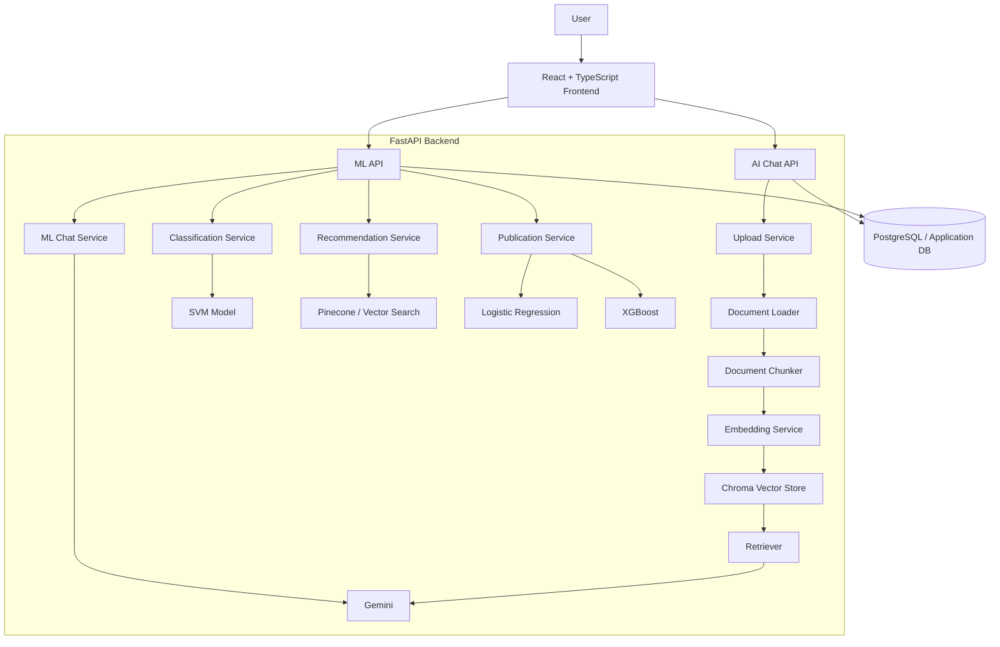
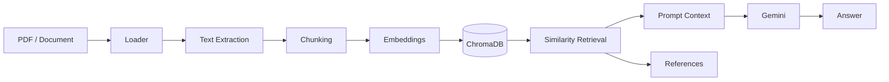
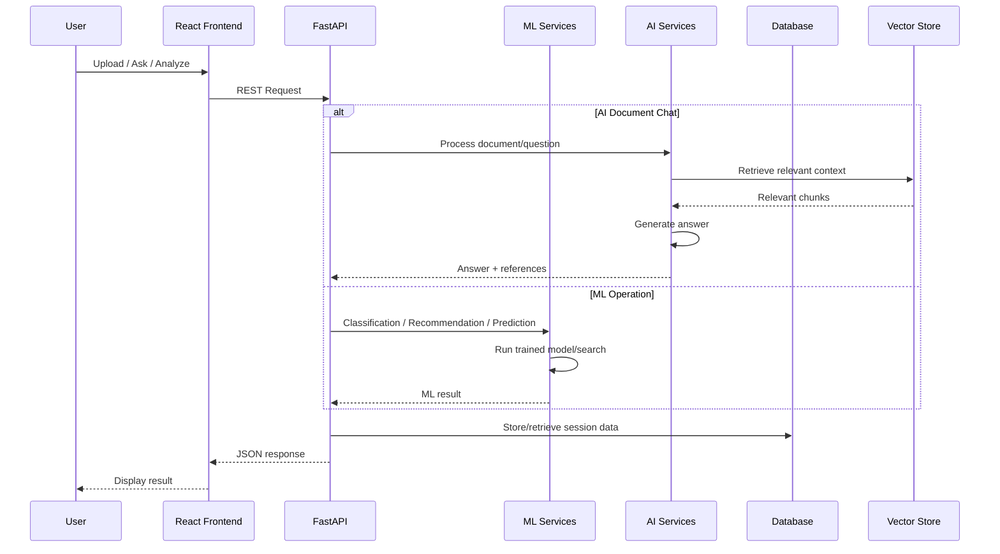

# 🔬 ResearchAI — AI-Powered Research Assistant Platform

<p align="center">
  <strong>Research • Understand • Classify • Recommend • Predict</strong>
</p>

<p align="center">
  An end-to-end AI/ML research platform that combines document-based AI chat,
  research-paper intelligence, machine-learning models, and a modern React dashboard.
</p>

<p align="center">
  
  
  
  
  
  
  
</p>

---

## 📌 Overview

**ResearchAI** is a full-stack AI/ML platform designed to help users work with research documents and research-paper data from a single interface.

The platform provides:

- 📄 **Document upload and AI chat**
- 🧠 **Context-aware document question answering**
- 🔎 **Research-paper search**
- 🏷️ **Research document classification**
- 📚 **Paper recommendation**
- 📈 **Publication prediction**
- 💬 **ML research chat**
- 📝 **Conversation history and summaries**
- 📑 **Reference/source display**
- ⚡ **FastAPI REST APIs**
- 🎨 **React + TypeScript dashboard**

The project separates the **AI document workflow** from the **ML research workflow**, so the existing AI Chat functionality can operate independently from the ML modules.

---

## ✨ Core Features

### 🤖 AI Document Chat

Upload a research document and interact with it through a conversational interface.

**Flow:**

```text
Document
   ↓
Document Loader
   ↓
Chunking
   ↓
Embeddings
   ↓
Vector Store
   ↓
Retriever
   ↓
Gemini
   ↓
Answer + References
```

The chat interface also supports:

- Chat sessions
- Chat history
- Session deletion
- Document upload
- Summaries
- Reference sidebar
- Conversation-based interaction

---

### 🧠 Machine Learning

ResearchAI contains dedicated ML functionality for research-paper analysis.

| Module | Purpose | Model / Approach |
|---|---|---|
| Classification | Predict research-paper category | Linear SVM |
| Recommendation | Find similar research papers | Embedding similarity + vector search |
| Publication | Predict publication-related outcome | Logistic Regression + XGBoost |
| ML Chat | Research-oriented conversational assistance | Gemini + research context |

---

### 🏷️ Research Classification

The classification module predicts a research-paper category from its textual content.

The final classification pipeline uses:

```text
Research Text
     ↓
Preprocessing
     ↓
Feature Representation
     ↓
SVM Classifier
     ↓
Predicted Category
```

The trained model and preprocessing artifacts are stored under:

```text
backend/services/ml/models/category/
```

---

### 📚 Research Paper Recommendation

The recommendation module finds papers related to a given research title and abstract.

```text
Title + Abstract
       ↓
Embedding / Vector Representation
       ↓
Similarity Search
       ↓
Top-K Research Papers
       ↓
Title + Authors + Category + Similarity
```

The system returns useful paper metadata such as:

- Paper ID
- Title
- Authors
- Category
- Similarity score
- Update date

---

### 📈 Publication Prediction

ResearchAI includes two trained publication-prediction models:

- Logistic Regression
- XGBoost

Stored under:

```text
backend/services/ml/models/publication/
```

The application can use these models through the ML API without retraining them for every request.

---

### 💬 ML Chat

ML Chat is separate from the document-based **AI Chat**.

It is intended for research-oriented questions such as:

> "How can transformers be used for information retrieval?"

or:

> "Which machine-learning approach would be suitable for classifying research papers?"

The response can explain the concept in an AI-generated conversational format while presenting relevant research context.

---

## 🏗️ System Architecture



---

## 🔄 AI Document Processing Pipeline



---

## 🖥️ Application Modules

### Dashboard

The dashboard provides an overview of the ResearchAI platform and gives users access to the major AI/ML modules.

### AI Chat

Document-focused conversational assistant with:

- Upload
- Chat sessions
- History
- Summary
- References

### ML Chat

Research/ML-oriented conversational assistant.

### Classification

Research-paper category prediction.

### Recommendation

Similar research-paper discovery.

### Publication

Publication prediction using trained ML models.

### Settings

Application profile and appearance settings.

---

## 📸 API Documentation

The backend exposes interactive Swagger/OpenAPI documentation.

### Swagger UI


The API documentation provides direct access to the available endpoints for development and testing.

---

## 🔌 API Endpoints

### Machine Learning

| Method | Endpoint | Description |
|---|---|---|
| `POST` | `/api/v1/search` | Research search |
| `POST` | `/api/v1/ml/classification` | Classify research text |
| `POST` | `/api/v1/ml/publication` | Publication prediction |
| `POST` | `/api/v1/ml/recommendation` | Research-paper recommendation |
| `POST` | `/api/v1/ml/chat` | ML/research chat |

### Artificial Intelligence

| Method | Endpoint | Description |
|---|---|---|
| `POST` | `/api/v1/ai/upload` | Upload a document |
| `POST` | `/api/v1/ai/chat` | Chat with uploaded document |
| `POST` | `/api/v1/ai/summary` | Generate conversation summary |
| `GET` | `/api/v1/ai/history/{session_id}` | Retrieve chat history |
| `GET` | `/api/v1/ai/sessions` | Retrieve chat sessions |
| `DELETE` | `/api/v1/ai/sessions/{session_id}` | Delete a chat session |

---

## 🧰 Technology Stack

### Backend

- Python
- FastAPI
- Uvicorn
- Pydantic
- SQLAlchemy
- PostgreSQL
- Python-dotenv
- Loguru

### AI / NLP

- Google Gemini
- LangChain
- LangChain Core
- LangChain Community
- LangChain Google GenAI
- LangChain HuggingFace
- Sentence Transformers
- Transformers
- PyTorch

### Vector Search

- ChromaDB
- Pinecone

### Machine Learning

- Scikit-learn
- XGBoost
- NumPy
- Pandas
- SciPy-compatible scientific tooling

### Frontend

- React
- TypeScript
- Vite
- Tailwind CSS
- Lucide React
- Axios / API client

### Development

- Git
- GitHub
- Jupyter
- Pytest

---

## 📁 Project Structure

```text
ResearchAI/
│
├── backend/
│   ├── app/
│   │   ├── core/
│   │   ├── database/
│   │   ├── dependencies/
│   │   ├── middleware/
│   │   ├── models/
│   │   ├── repositories/
│   │   └── utils/
│   │
│   ├── api/
│   │   ├── routes/
│   │   └── schemas/
│   │
│   ├── services/
│   │   ├── ai/
│   │   │   ├── document/
│   │   │   ├── graph/
│   │   │   ├── chat_service.py
│   │   │   ├── retriever.py
│   │   │   └── upload_service.py
│   │   │
│   │   ├── ml/
│   │   │   ├── models/
│   │   │   ├── classification_service.py
│   │   │   ├── recommendation_service.py
│   │   │   ├── publication_service.py
│   │   │   └── chat_service.py
│   │   │
│   │   └── providers/
│   │
│   ├── requirements-freeze.txt
│   └── main.py
│
├── frontend/
│   ├── src/
│   │   ├── api/
│   │   ├── components/
│   │   ├── layout/
│   │   └── pages/
│   │       ├── AIChat/
│   │       ├── Dashboard/
│   │       ├── ML/
│   │       └── Settings/
│   │
│   ├── package.json
│   └── vite.config.ts
│
├── notebooks/
│   └── # experimentation and model development
│
├── src/
│   ├── classifications/
│   ├── etl/
│   ├── llm/
│   ├── prompts/
│   ├── rag/
│   └── vectorstore/
│
├── models/
├── requirements.txt
├── test_cases_classification.txt
└── README.md
```

---

## ⚙️ Installation

### 1. Clone the repository

```bash
git clone https://github.com/Ashutosh-Jarag/cdac-aiml-project.git
cd cdac-aiml-project
```

### 2. Create a Python environment

Windows:

```powershell
python -m venv myenv
myenv\Scripts\activate
```

Linux/macOS:

```bash
python3 -m venv myenv
source myenv/bin/activate
```

### 3. Install backend dependencies

```bash
pip install -r requirements.txt
```

If you want the frozen backend environment:

```bash
pip install -r backend/requirements-freeze.txt
```

### 4. Configure environment variables

Create a local `.env` file:

```env
GOOGLE_API_KEY=your_google_api_key
PINECONE_API_KEY=your_pinecone_api_key
```

> Never commit `.env` or API keys to GitHub.

### 5. Start the backend

From the project root:

```bash
uvicorn backend.main:app --reload
```

Swagger documentation:

```text
http://127.0.0.1:8000/docs
```

### 6. Install frontend dependencies

```bash
cd frontend
npm install
```

### 7. Start the frontend

```bash
npm run dev
```

The Vite development server will provide the frontend URL in the terminal.

---

## 🧪 Testing

The project includes classification test cases:

```text
test_cases_classification.txt
```

Backend tests can be executed with:

```bash
pytest
```

API functionality can also be tested directly through:

```text
http://127.0.0.1:8000/docs
```

---

## 🔐 Security

The project uses environment variables for credentials.

Never commit:

```text
.env
API keys
access tokens
database passwords
private credentials
```

The repository `.gitignore` excludes local secrets and generated development files.

---

## 🧠 Why ResearchAI?

Research work often requires switching between:

- reading documents,
- searching research papers,
- understanding papers,
- classifying research,
- finding related work,
- and evaluating publication-related predictions.

ResearchAI brings these workflows together in a single application.

---

## 📊 ML Model Summary

| Task | Model | Input |
|---|---|---|
| Classification | SVM | Research-paper text |
| Recommendation | Embedding similarity | Title + abstract |
| Publication prediction | Logistic Regression | Publication features |
| Publication prediction | XGBoost | Publication features |
| AI document chat | Gemini + retrieval | Uploaded document + question |
| ML chat | Gemini | Research/ML question |

---

## 🚀 Application Flow



---

## 📌 Current Project Scope

ResearchAI currently focuses on:

- AI-powered document interaction
- Research-paper analysis
- Research classification
- Research recommendations
- Publication prediction
- ML/research chat
- Full-stack web integration

The application is structured so the AI and ML workflows remain modular and independently maintainable.

---

## 👨‍💻 Author

**Ashutosh Jarag**

B.Tech — Computer Science / Data Science  
PG-Diploma in Big Data Analytics

### Areas

- Artificial Intelligence
- Machine Learning
- Generative AI
- NLP
- Data Engineering
- Big Data
- Full-Stack AI Applications

---

## ⭐ If you find this project useful

Give the repository a ⭐ on GitHub and feel free to explore the implementation.

---

<p align="center">
  <strong>ResearchAI — Turning research data into actionable intelligence.</strong>
</p>
